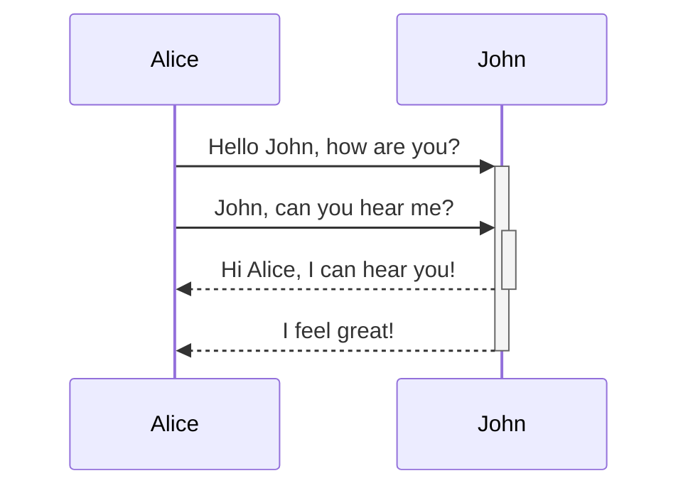
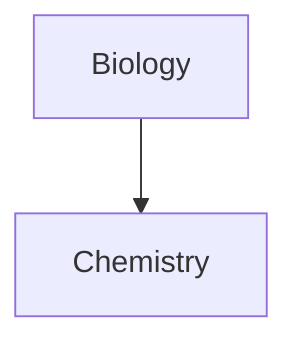
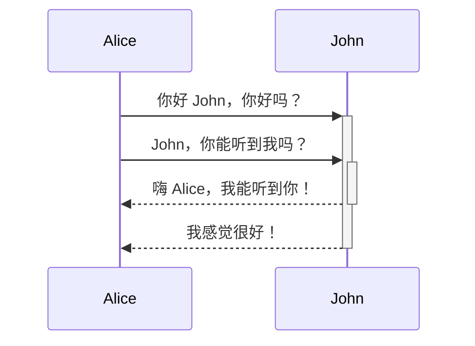
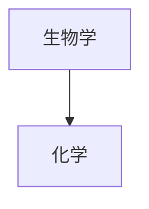

---
aliases:
  - Advanced Markdown
---
Learn how to add advanced formatting syntax to your notes.

## Tables

You can create table using vertical bars (`|`) and hyphens (`-`). Vertical bars separate columns, and hyphens define the column header.

```md
| First name | Last name |
| ---------- | --------- |
| Max        | Planck    |
| Marie      | Curie     |
```

| First name | Last name |
| ---------- | --------- |
| Max        | Planck    |
| Marie      | Curie     |

The vertical bars on either side of the table are optional.

Cells don't need to be perfectly aligned with the columns. Each header row must have at least two hyphens.

```md
First name | Last name
-- | --
Max | Planck
Marie | Curie
```

### Format content within a table

You can use [[basic formatting syntax]] to style content within a table.

First column | Second column
-- | --
[[Internal links]] | Link to a file _within_ your **vault**.
[[Embed files]] | ![[og-image.png\|200]]

> [!note] Vertical bars in tables
> If you want to use [[aliases]], or to [[Basic formatting syntax#External images|resize an image]] in your table, you need to add a `\` before the vertical bar.
>
> ```md
> First column | Second column
> -- | --
> [[Basic formatting syntax\|Markdown syntax]] | ![[og-image.png\|200]]
> ```
>
> First column | Second column
> -- | --
> [[Basic formatting syntax\|Markdown syntax]] | ![[og-image.png\|200]]

You can align text to the left, right, or center of a column by adding colons (`:`) to the header row.

```md
Left-aligned text | Center-aligned text | Right-aligned text
:-- | :--: | --:
Content | Content | Content
```

Left-aligned text | Center-aligned text | Right-aligned text
:-- | :--: | --:
Content | Content | Content

## Diagram

You can add diagrams and charts to your notes, using [Mermaid](https://mermaid-js.github.io/). Mermaid supports a range of diagrams, such as [flow charts](https://mermaid.js.org/syntax/flowchart.html), [sequence diagrams](https://mermaid.js.org/syntax/sequenceDiagram.html), and [timelines](https://mermaid.js.org/syntax/timeline.html).

> [!tip]
> You can also try Mermaid's [Live Editor](https://mermaid-js.github.io/mermaid-live-editor) to help you build diagrams before you include them in your notes.

To add a Mermaid diagram, create a `mermaid` [[Basic formatting syntax#Code blocks|code block]].

````md

````


````md

````


### Linking files in a diagram

You can create [[internal links]] in your diagrams by attaching the `internal-link` [class](https://mermaid.js.org/syntax/flowchart.html#classes) to your nodes.

````md

````


> [!note]
> Internal links from diagrams don't show up in the [[Graph view]].

If you have many nodes in your diagrams, you can use the following snippet.

````md

````

This way, each letter node becomes an internal link, with the [node text](https://mermaid.js.org/syntax/flowchart.html#a-node-with-text) as the link text.

> [!note]
> If you use special characters in your note names, you need to put the note name in double quotes.
>
> ```
> class "⨳ special character" internal-link
> ```
>
> Or, `A["⨳ special character"]`.

For more information about creating diagrams, refer to the [official Mermaid docs](https://mermaid.js.org/intro/).

## Math

You can add math expressions to your notes using [MathJax](http://docs.mathjax.org/en/latest/basic/mathjax.html) and the LaTeX notation.

To add a MathJax expression to your note, surround it with double dollar signs (`$$`).

```md
$$
\begin{vmatrix}a & b\\
c & d
\end{vmatrix}=ad-bc
$$
```

$$
\begin{vmatrix}a & b\\
c & d
\end{vmatrix}=ad-bc
$$

You can also inline math expressions by wrapping it in `$` symbols.

```md
This is an inline math expression $e^{2i\pi} = 1$.
```

This is an inline math expression $e^{2i\pi} = 1$.

For more information about the syntax, refer to [MathJax basic tutorial and quick reference](https://math.meta.stackexchange.com/questions/5020/mathjax-basic-tutorial-and-quick-reference).

For a list of supported MathJax packages, refer to [The TeX/LaTeX Extension List](http://docs.mathjax.org/en/latest/input/tex/extensions/index.html).


---

中文翻译：
---
aliases:
  - 高级 Markdown
---
学习如何在你的笔记中添加高级格式语法。

## 表格

你可以使用竖线（`|`）和短横线（`-`）来创建表格。竖线用于分隔列，短横线定义列标题。

```md
| 名字 | 姓氏 |
| ---- | ---- |
| 麦克斯 | 普朗克 |
| 玛丽 | 居里 |
```

| 名字 | 姓氏 |
| ---- | ---- |
| 麦克斯 | 普朗克 |
| 玛丽 | 居里 |

表格两侧的竖线是可选的。

单元格不需要与列完全对齐。每个标题行至少要有两个短横线。

```md
名字 | 姓氏
-- | --
麦克斯 | 普朗克
玛丽 | 居里
```

### 格式化表格内容

你可以使用[[基本格式语法]]来为表格内的内容添加样式。

第一列 | 第二列
-- | --
[[内部链接]] | 链接到**vault**内的文件。
[[嵌入文件]] | ![[og-image.png\|200]]

> [!注意] 表格中的竖线
> 如果你想在表格中使用[[别名]]，或者在表格中[[基本格式语法#外部图片|调整图片大小]]，你需要在竖线前加上 `\`。
>
> ```md
> 第一列 | 第二列
> -- | --
> [[基本格式语法\|Markdown 语法]] | ![[og-image.png\|200]]
> ```
>
> 第一列 | 第二列
> -- | --
> [[基本格式语法\|Markdown 语法]] | ![[og-image.png\|200]]

通过在标题行中添加冒号（`:`），你可以将文本左对齐、居中或右对齐。

```md
左对齐文本 | 居中文本 | 右对齐文本
:-- | :--: | --:
内容 | 内容 | 内容
```

左对齐文本 | 居中文本 | 右对齐文本
:-- | :--: | --:
内容 | 内容 | 内容

## 图表

你可以使用 [Mermaid](https://mermaid-js.github.io/) 在笔记中添加图表和流程图。Mermaid 支持多种图表，如[流程图](https://mermaid.js.org/syntax/flowchart.html)、[时序图](https://mermaid.js.org/syntax/sequenceDiagram.html)和[时间线](https://mermaid.js.org/syntax/timeline.html)等。

> [!提示]
> 你也可以尝试使用 Mermaid 的 [在线编辑器](https://mermaid-js.github.io/mermaid-live-editor) 来帮助你在笔记中添加图表。

要添加 Mermaid 图表，创建一个 `mermaid` [[基本格式语法#代码块|代码块]]。

````md

````


````md

````


### 在图表中添加链接

你可以通过将 `internal-link` [class](https://mermaid.js.org/syntax/flowchart.html#classes) 附加到节点来在图表中创建[[内部链接]]。

````md

````


> [!注意]
> 图表中的内部链接不会显示在[[图形视图]]中。

如果你的图表中有很多节点，你可以使用以下代码片段。

````md

````

这样，每个字母节点都会成为一个内部链接，[节点文本](https://mermaid.js.org/syntax/flowchart.html#a-node-with-text)将作为链接文本。

> [!注意]
> 如果你的笔记名称中包含特殊字符，你需要将笔记名称放在双引号中。
>
> ```
> class "⨳ 特殊字符" internal-link
> ```
>
> 或者 `A["⨳ 特殊字符"]`。

欲了解更多有关创建图表的信息，请参阅[官方 Mermaid 文档](https://mermaid.js.org/intro/)。

## 数学

你可以使用 [MathJax](http://docs.mathjax.org/en/latest/basic/mathjax.html) 和 LaTeX 符号在笔记中添加数学表达式。

要在笔记中添加 MathJax 表达式，请用双美元符号（`$$`）将其括起来。

```md
$$
\begin{vmatrix}a & b\\
c & d
\end{vmatrix}=ad-bc
$$
```

$$
\begin{vmatrix}a & b\\
c & d
\end{vmatrix}=ad-bc
$$

你也可以用 `$` 符号包裹数学表达式来实现行内数学公式。

```md
这是一个行内数学表达式 $e^{2i\pi} = 1$。
```

这是一个行内数学表达式 $e^{2i\pi} = 1$。

欲了解更多有关语法的信息，请参阅[MathJax 基础教程和快速参考](https://math.meta.stackexchange.com/questions/5020/mathjax-basic-tutorial-and-quick-reference)。

要查看支持的 MathJax 包列表，请参阅[TeX/LaTeX 扩展列表](http://docs.mathjax.org/en/latest/input/tex/extensions/index.html)。