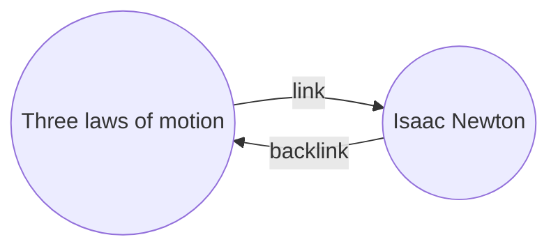
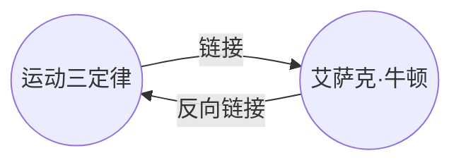

With the Backlinks plugin, you can see all the _backlinks_ for the active note.

A backlink for a note is a link from another note to that note. In the following example, the "Three laws of motion" note contains a link to the "Isaac Newton" note. The corresponding backlink would link from "Isaac Newton" back to "Three laws of motion".

Backlinks can be useful to find notes that reference the note you're writing. Just imagine if you could list the backlinks for any website on the internet.

## Show backlinks

The Backlinks plugin displays the backlinks for the active tabs. There are two collapsible sections: **Linked mentions** and **Unlinked mentions**.

- **Linked mentions** are backlinks to the notes that contain an internal link to the active note.
- **Unlinked mentions** are backlinks to any unlinked occurrence of the name of the active note.

It provides the following options:

- **Collapse results** toggles whether to expand each note to display the mentions in it.
- **Show more context** toggles whether to truncate or display the full paragraph that contains the mention.
- **Change sort order** determines how to sort the mentions.
- **Show search filter** toggles a text field that lets you filter the mentions. For more information on how to build a search query, refer to [[Search]].

## View backlinks for a note

To view the backlinks for the active note, click the **Backlinks** (link and arrow icon) tab in the right sidebar.

> [!note]
> If you can't see the Backlinks tab, you can make it visible by opening the [[Command palette]] and running the **Backlinks: Show backlinks** command.

## See backlinks of a specific note

The backlinks tab lists backlinks for the active note and updates when you switch to a different note. If you want to see the backlinks for a specific note, regardless of whether it's active or note, you can open a _linked_ backlinks tab.

To open a linked backlinks tab:

1. Open the [[Command palette]].
2. Select **Backlinks: Open backlinks for the current note**.

A separate tab opens next to your active note. The tab shows a link icon to let you know it's linked to a note.

## Show backlinks in a note

Instead of showing the backlinks in a separate tab, you can show the backlinks at the bottom of your note.

To show backlinks in a note:

1. Open the [[Command palette]].
2. Select **Backlinks: Toggle backlinks in document**.

Or, enable **Backlink in document** under the Backlinks plugin options to automatically toggle backlinks when you open a new note.

---

中文翻译：
---
aliases: 
- 如何/使用反向链接
---

使用反向链接插件，你可以查看当前笔记的所有_反向链接_。

一个笔记的反向链接是指从另一个笔记指向该笔记的链接。在下面的例子中，“运动三定律”笔记包含一个指向“艾萨克·牛顿”笔记的链接。相应的反向链接将从“艾萨克·牛顿”指向“运动三定律”。

反向链接对于查找引用当前正在编写的笔记的笔记非常有用。想象一下，如果你可以列出互联网上任何网站的反向链接。

## 显示反向链接

反向链接插件会显示活动标签页的反向链接。有两个可折叠的部分：**链接提及**和**未链接提及**。

- **链接提及**是指那些包含对活动笔记的内部链接的笔记的反向链接。
- **未链接提及**是指活动笔记名称的任何未链接出现的反向链接。

它提供以下选项：

- **折叠结果** 切换是否展开每个笔记以显示其中的提及。
- **显示更多上下文** 切换是否截断或显示包含提及的完整段落。
- **更改排序顺序** 确定如何对提及进行排序。
- **显示搜索过滤器** 切换一个文本字段，让你过滤提及。有关如何构建搜索查询的更多信息，请参阅[[搜索]]。

## 查看笔记的反向链接

要查看活动笔记的反向链接，请点击右侧边栏中的**反向链接**（链接和箭头图标）选项卡。

> [!注意]
> 如果你看不到反向链接选项卡，可以通过打开[[命令面板]]并运行**反向链接: 显示反向链接**命令来使其可见。

## 查看特定笔记的反向链接

反向链接选项卡列出了活动笔记的反向链接，并在切换到不同笔记时进行更新。如果你想查看特定笔记的反向链接，无论它是否是活动笔记，都可以打开一个_链接的_反向链接选项卡。

要打开一个链接的反向链接选项卡：

1. 打开[[命令面板]]。
2. 选择**反向链接: 打开当前笔记的反向链接**。

会在你的活动笔记旁边打开一个单独的选项卡。该选项卡显示一个链接图标，以便让你知道它链接到一个笔记。

## 在笔记中显示反向链接

与在单独的选项卡中显示反向链接不同，你可以将反向链接显示在你的笔记底部。

要在笔记中显示反向链接：

1. 打开[[命令面板]]。
2. 选择**反向链接: 切换文档中的反向链接**。

或者，在反向链接插件选项下启用**文档中的反向链接**，以在打开新笔记时自动切换反向链接。